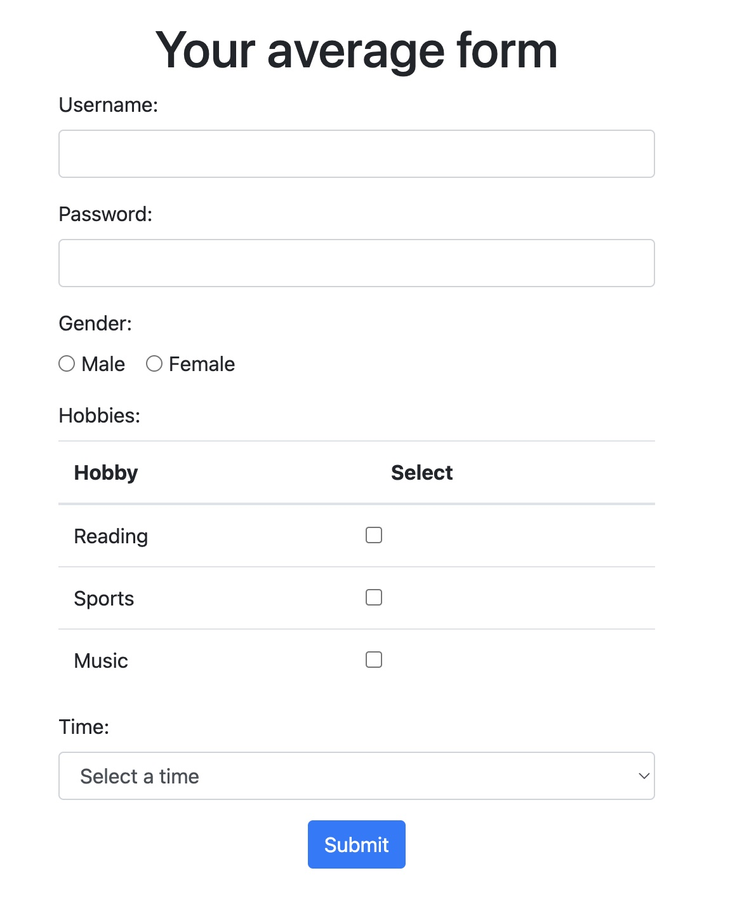

# Requirements:
- Node.js v20.5.1 or later
- Playwright v1.53.2 (installed via npm)

# Installation  
```bash
npm install
```

# Start the application server  
```bash
npm run serve
```
This will start the application on http://localhost:3000

# Running tests  
```bash
npm run test          # Run tests in headless mode
npm run test:ui       # Run tests with UI mode
```

# Assignment  
This project contains a simple form application called "Your average form".  
  
Your task is to cover this form application with automated tests using [Playwright](https://playwright.dev/).  

## Project Structure
- `app/` - Contains the application code
  - `index.html` - The form page
  - `index.js` - The Express server
  - `results.ejs` - The results page template
- `tests/` - Contains the test files
  - `index.spec.js` - Basic test file to get started

## Testing Requirements
Please complete the following tasks:
- Explore the "Your average form" application
- Create comprehensive testing scenarios
- Implement tests for those scenarios using Playwright
- Implement the Page Object Pattern for better test structure

Although the application is simple, please ensure high-quality code with proper formatting and organization.

Good luck and have fun!